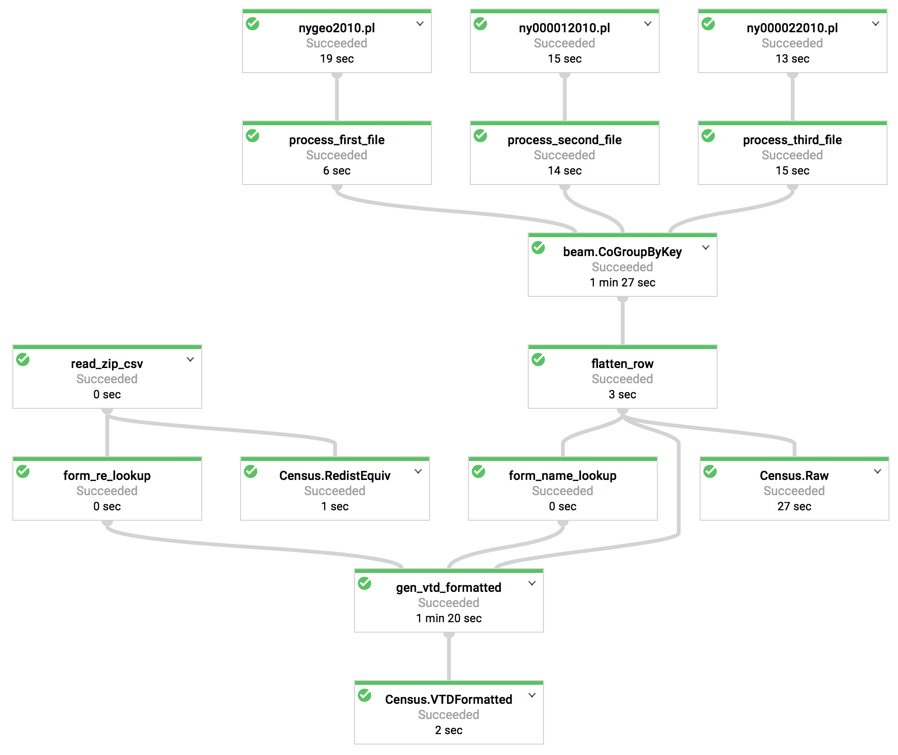

# Census

Data from the 2010 US Redistricting Census.

Download input data from the Census website:
```
curl https://www2.census.gov/census_2010/01-Redistricting_File--PL_94-171/New_York/ny2010.pl.zip > ny2010.pl.zip
unzip ny2010.pl.zip
gsutil cp *.pl gs://upload-raw/census/
```

Load the Redistricting Equivalents and CountyCodes metadata:

```
python load_redistequiv.py
bq load Census.SummaryLevels SummaryLevels.data.csv SummaryLevels.schema.json
```

## Pipeline



To run the pipeline:

```
python pipeline.py \
  --runner=DataflowRunner \
  --temp_location=gs://<temp bucket> \
  --staging_location=gs://<staging bucket> \
  --max_num_workers=8 \
  --disk_size_gb=100
```

At present the pipeline relies on the files being present in GCS bucket
`gs://upload-raw/census/`.
