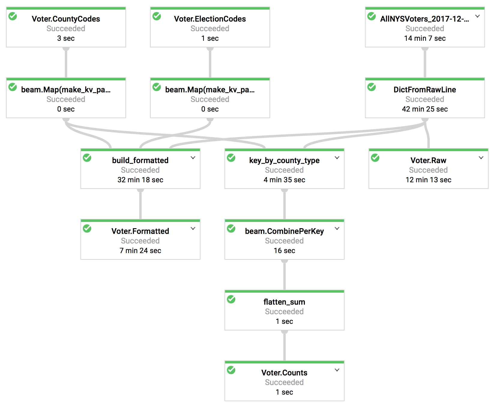

# Voter

## Preparation and Metadata

This pipeline processes the New York State Voter File and turns it into tables in BigQuery.

To convert the voter file to UTF-8 and upload to Cloud Storage:

```bash
$ pip install --upgrade iconv
$ iconv -f LATIN1 -t UTF-8 AllNYSVotersWph_12272017.txt > AllNYSVoters_2017-12-27.csv
$ gsutil cp AllNYSVoters_2017-12-27.csv gs://<your bucket name>/
```

To load the metadata tables to BigQuery:

```bash
$ bq load Voter.CountyCodes CountyCodes.data.csv CountyCodes.schema.json
$ bq load Voter.ElectionCodes ElectionCodes.data.csv ElectionCodes.schema.json
```

Note that the Voter county codes (Voter.CountyCodes) are different to the
Census FIPS county codes (Census.CountyCodes).

## Pipeline



The pipeline works as follows:

* `Voter.CountyCodes` and `Voter.ElectionCodes` are loaded from BigQuery and converted to key, value (K, V) dictionaries
* The main Voter File CSV is loaded from Cloud Storage and some basic type conversion done to create a "raw" dataset
* Then three steps occur in parallel:
  * The raw dataset is stored to BigQuery
  * A function called `build_formatted` creates friendlier data, e.g. builds whole addresses and names, and calculates the number of recent elections the voter has participated in
  * Counts of voters per party and election district are calculated.

To run the pipeline on Cloud Dataflow:

```bash
$ source venv/bin/activate
$ python pipeline.py \
  --runner=DataflowRunner \
  --temp_location=gs://<temp bucket> \
  --staging_location=gs://<staging bucket> \
  --disk_size_gb=50
```

This takes about 15 minutes to run.

NB users of the Google Cloud Platform free trial are limited to a maximum of 8 concurrent VMs and 2 TB of persistent disk.

To test with a sample dataset in local mode, edit the address of the voter file in the code to point to a cut-down version, and run:

```bash
$ python pipeline.py --runner=DirectRunner
```
